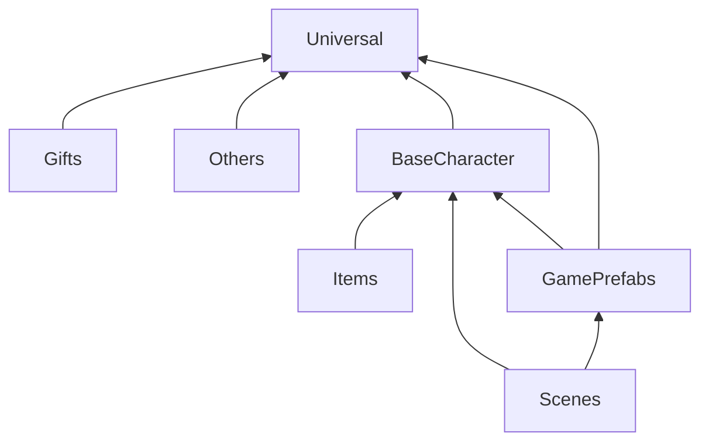

[TOC]
# 资源存放规则
### 1.资源依赖规则流程图

### 2.存放说明
| 文件夹名 | 存放资源规则 |
| :---: | --- |
| Unviersal   | 该文件夹仅存放通用的资源，例如:Shader、贴图、动画等文件，每个类型的资源放到一个文件夹中 |
| BaseCharacter | 该文件夹存储基础人物模型相关的资源。 存放裸模和裸模相关的shader、贴图、材质球、mesh、动画、预制体等资源。 每个分类都存放到单独的文件夹 |
| GamePrefabs | 按业务场景分类。例如:换装室、聊天室等  存储需要配置的预制体。且该预制体尽量不依赖模型除基础模型外的模型资源 |
| Scenes | 存储场景及场景相关资源。  分为三个文件夹 1.Scenes存储需要打包的场景文件。 2.SceneModels存储场景模型、贴图、材质等资源。 3.OtherScenes 存储不需要打包的场景。例如测试场景、编辑器场景等|
| Items | 存放换装所需要的资源。 按性别分类，每种性别下按换装部位分类 |
| Gifts | 存放礼物相关的资源。  分为模型资源和预制体资源两个文件夹 |
| OthersRes | 存放其他资源，按资源类型分类。例如:音效、特效、字体等 |

### 3.打包规则
该表写明了Addressables Groups与资源文件夹的对应关系，每个组的打包方式。
| Addressables Groups | 文件夹 | 打包方式 | 
| :---: | :---: | --- |
| Universal | Universal | 整体打包 | 
| BaseCharacter | BaseCharacter | 每个文件夹为一个包。 预制体文件夹下的每个资源需要单独成一个包 |
| GamePrefabs | GamePrefabs | 每个文件夹为一个包|
| Scenes | Scenes/Scenes | Scenes文件夹下每个场景文件单独为一个包|
| SceneModel | Scenes/SceneModels | 该文件夹下每个资源文件成一个单独的包 |
| Items| Items | 每个资源为一个单独的包，如果某个资源对应多套服装则需要将模型的贴图资源单独打包，并且将每个模型单独打包|
| Gifts | Gifts | 分为两部分，Gifts/GiftModel下的每个资源文件夹为一个单独的包 Gifts/Gifts下每个预制体为一个单独的包|
|Sounds|OthersRes/Sounds|每个资源文件为一个包|
|Effects|OtherRes/Effects|每个资源文件夹为一个包，每个预制体为一个包|
